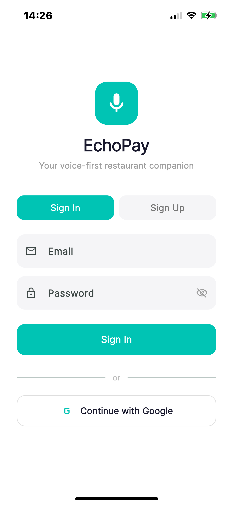
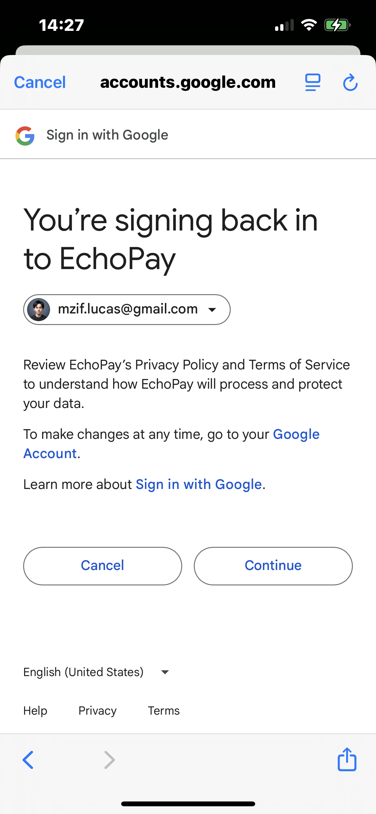
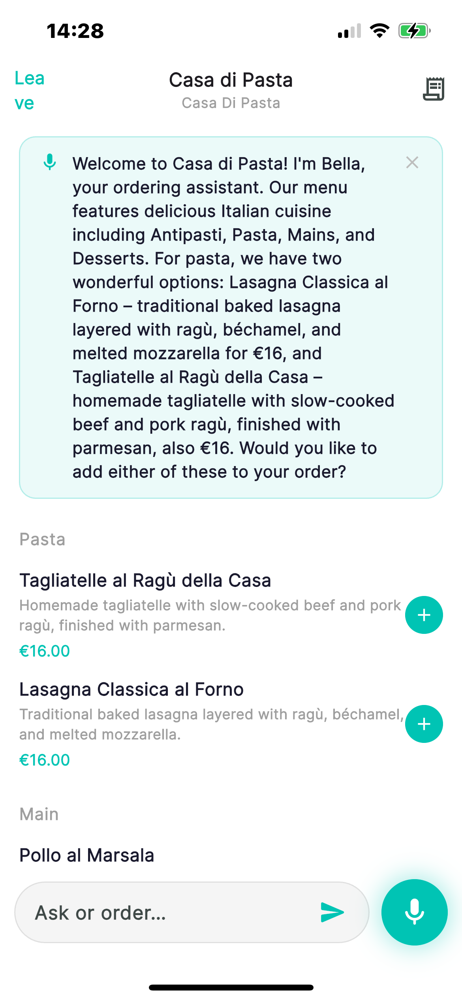
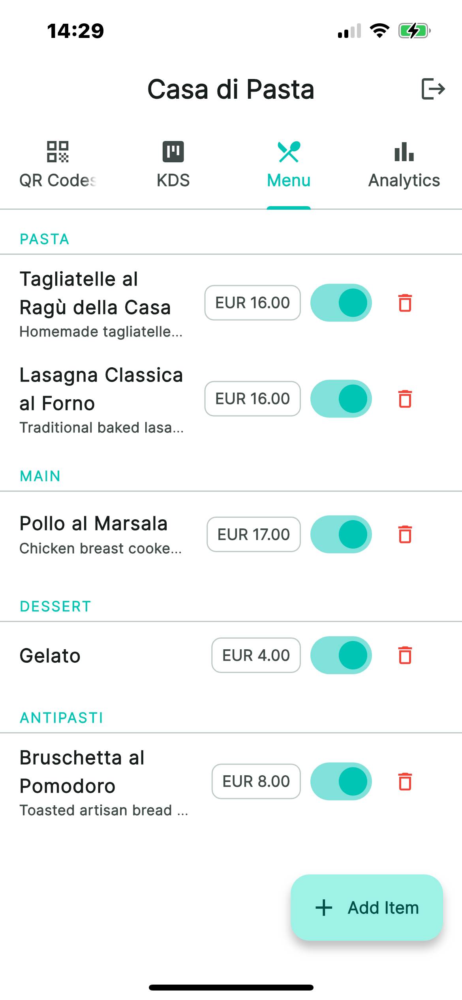
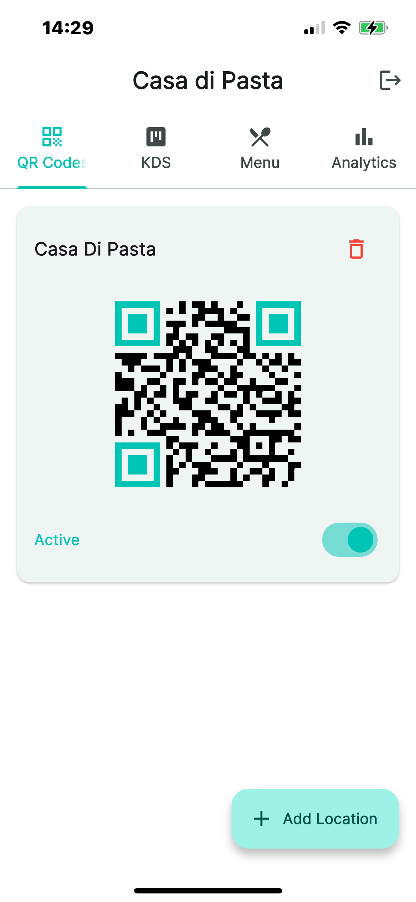
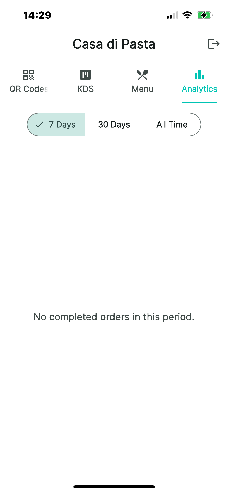

<h1 align="center">EchoPay</h1>

<p align="center">
  <strong>Voice-first AI ordering agent for restaurants</strong>
</p>

<p align="center">
  <a href="#features">Features</a> &middot;
  <a href="#screenshots">Screenshots</a> &middot;
  <a href="#architecture">Architecture</a> &middot;
  <a href="#tech-stack">Tech Stack</a> &middot;
  <a href="#getting-started">Getting Started</a> &middot;
  <a href="#api-reference">API Reference</a> &middot;
  <a href="#database-schema">Database Schema</a>
</p>

---

EchoPay replaces the cashier and waiter at quick-service and casual restaurants with an intelligent voice agent. Customers scan a QR code at a table or counter, speak to the agent in their own language, and the agent — grounded in that restaurant's menu, inventory, and hours — answers questions, recommends dishes, and places the order. Payment is settled automatically through the bunq API upon customer approval.

Restaurants save labor costs and eliminate queues. Customers get instant multilingual service and an agent that remembers their preferences across visits.

## Screenshots

<p align="center">
  
  &nbsp;&nbsp;
  
  &nbsp;&nbsp;
  
</p>

<p align="center">
  <em>Sign in with email or Google &nbsp;&bull;&nbsp; AI voice agent takes your order</em>
</p>

<br/>

<p align="center">
  
  &nbsp;&nbsp;
  
  &nbsp;&nbsp;
  
</p>

<p align="center">
  <em>Menu management &nbsp;&bull;&nbsp; QR code generation &nbsp;&bull;&nbsp; Analytics dashboard</em>
</p>

## Features

### For Customers

- **Voice Ordering** — Speak naturally; the agent transcribes, understands, and processes orders
- **Multilingual** — The agent responds in the customer's language
- **Smart Recommendations** — Context-aware suggestions based on menu, preferences, and dietary needs
- **Allergy & Diet Tracking** — Remembered across sessions so you never have to repeat yourself
- **Seamless Payments** — bunq-based checkout with a simple confirmation flow
- **QR Code Entry** — Scan a table-specific QR code to start ordering instantly

### For Restaurants

- **Kitchen Display System (KDS)** — Real-time order queue with status updates
- **Menu Management** — Full CRUD for items, categories, modifiers, pricing, and inventory
- **QR Code Generator** — Create and manage codes for every table or counter
- **Analytics Dashboard** — Order insights, revenue metrics, and popular items
- **Custom Agent Name** — Brand the voice agent with your restaurant's personality
- **Flexible Config** — Currency, opening hours, language, payment destination

## Architecture

```
                  +------------------+
                  |   Flutter App    |
                  |  (iOS/Android)   |
                  +--------+---------+
                           |
                    REST / Audio
                           |
                  +--------v---------+
                  |   FastAPI Agent   |
                  |    (Python)       |
                  +--+-----+------+--+
                     |     |      |
           +---------+  +--+--+  +----------+
           |            |     |             |
     +-----v-----+ +---v---+ +---v---+ +---v--------+
     | Google ADK | | bunq  | |OpenAI | |  Supabase  |
     | + Claude   | |  API  | |Whisper| | PostgreSQL |
     | (LLM)      | |(Pay)  | |& TTS  | |  + Auth    |
     +-----------+ +-------+ +-------+ +------------+
```

**Agent Conversation Flow:**

1. Customer scans QR code and speaks
2. Flutter app records audio and sends to `/agent/turn`
3. FastAPI backend builds context (menu, preferences, cart, history)
4. Google ADK + Claude processes the turn with tool access
5. Agent responds with message, cart intents, and optional audio
6. Customer confirms changes; payment is initiated via bunq
7. bunq webhook updates order status in Supabase
8. KDS displays the confirmed order to kitchen staff

## Tech Stack

| Layer | Technology | Purpose |
|-------|-----------|---------|
| Mobile App | Flutter / Dart | Customer & admin interfaces (iOS + Android) |
| Backend API | FastAPI / Python | REST endpoints, agent orchestration |
| Agent Brain | Google ADK + Anthropic Claude | Conversation, intent parsing, tool use |
| LLM Routing | LiteLLM | Multi-provider LLM abstraction |
| Database | Supabase (PostgreSQL) | Data storage, RLS, real-time subscriptions |
| Auth | Supabase Auth | Email, Google, Apple sign-in |
| Payments | bunq API | Payment requests, transfers, webhooks |
| Speech-to-Text | OpenAI Whisper | Customer voice transcription |
| Text-to-Speech | OpenAI TTS | Agent voice synthesis |
| Webhooks | Supabase Edge Functions (Deno) | bunq payment status callbacks |

## Project Structure

```
EchoPay/
├── app/                            # Flutter mobile app
│   ├── lib/
│   │   ├── main.dart               # Entry point
│   │   ├── pages/                  # UI screens
│   │   │   ├── landing.dart        # Auth (email, Google, Apple)
│   │   │   ├── user_home.dart      # Customer: QR scan + voice ordering
│   │   │   ├── user_order.dart     # Customer: order summary + payment
│   │   │   ├── admin_dashboard.dart # Restaurant owner dashboard
│   │   │   ├── admin_kds_tab.dart  # Kitchen display system
│   │   │   └── admin_menu_management.dart
│   │   └── services/              # Business logic
│   │       ├── agent.dart          # Agent API client
│   │       ├── payment.dart        # bunq payment workflow
│   │       ├── voice_order_service.dart
│   │       └── whisper.dart        # STT wrapper
│   └── pubspec.yaml
│
├── agent/                          # Python FastAPI backend
│   ├── app/
│   │   ├── main.py                 # App entry point
│   │   ├── config.py               # Environment config
│   │   ├── routes/
│   │   │   ├── agent.py            # POST /agent/turn
│   │   │   ├── voice.py            # STT & TTS endpoints
│   │   │   └── payments.py         # bunq payment endpoints
│   │   └── services/
│   │       ├── adk_loop.py         # Agent orchestration loop
│   │       ├── adk_tools.py        # ADK tool definitions
│   │       ├── supabase_context.py # Database queries & JWT auth
│   │       └── bunq_service.py     # bunq API wrapper
│   ├── echopay_adk/                # ADK agent entry point
│   └── pyproject.toml
│
└── supabase/                       # Supabase config
    └── functions/
        └── bunq-webhook/           # Edge Function for payment callbacks
            └── index.ts
```

## Getting Started

### Prerequisites

- Flutter SDK 3.11+
- Python 3.11+
- [uv](https://docs.astral.sh/uv/) (Python package manager)
- A [Supabase](https://supabase.com) project
- API keys for: Anthropic (Claude), OpenAI, bunq (sandbox)

### Backend Setup

```bash
cd agent
cp .env.example .env
```

Fill in your `.env`:

```env
ANTHROPIC_API_KEY=sk-ant-...
ANTHROPIC_MODEL=anthropic/claude-3-5-sonnet-20241022
OPENAI_API_KEY=sk-...
SUPABASE_URL=https://your-project.supabase.co
SUPABASE_SERVICE_ROLE_KEY=eyJ...
SUPABASE_JWT_SECRET=your-jwt-secret
BUNQ_API_KEY=sandbox_...
```

Start the server:

```bash
uv sync
uv run uvicorn app.main:app --reload --host 0.0.0.0 --port 8000
```

### Flutter App Setup

```bash
cd app
flutter pub get
```

Create `app/.env` with your Supabase credentials:

```env
SUPABASE_URL=https://your-project.supabase.co
SUPABASE_ANON_KEY=eyJ...
```

Run the app:

```bash
flutter run
```

### Deploy the Webhook

```bash
supabase functions deploy bunq-webhook
```

## API Reference

### Agent

| Method | Endpoint | Description |
|--------|----------|-------------|
| `POST` | `/agent/turn` | Main conversation endpoint (text or audio) |

### Voice

| Method | Endpoint | Description |
|--------|----------|-------------|
| `POST` | `/voice/transcribe` | Speech-to-text via Whisper |
| `POST` | `/voice/synthesize` | Text-to-speech |
| `POST` | `/voice/order` | Structured order extraction from voice |

### Payments

| Method | Endpoint | Description |
|--------|----------|-------------|
| `POST` | `/payments/request` | Create a bunq payment request |
| `POST` | `/payments/direct` | Direct payment transfer |
| `GET`  | `/payments/request/{id}` | Check payment status |

### Health

| Method | Endpoint | Description |
|--------|----------|-------------|
| `GET`  | `/health` | Service health check |

## Database Schema

Core tables managed by Supabase (PostgreSQL with Row-Level Security):

- **customers** — User profiles, allergies, dietary preferences, language
- **restaurants** — Config: agent name, currency, hours, payment destination
- **qr_locations** — Table/counter QR codes linked to restaurants
- **menu_items** — Items with categories, pricing, inventory, dietary tags, translations
- **modifier_groups / modifiers** — Customization options (size, extras, etc.)
- **orders** — Full lifecycle: `draft` &rarr; `pending_payment` &rarr; `confirmed` &rarr; `in_progress` &rarr; `ready` &rarr; `completed`
- **order_items / order_item_modifiers** — Line items with selected modifiers
- **bunq_connections** — Encrypted OAuth tokens for customer payments

## License

All rights reserved.
